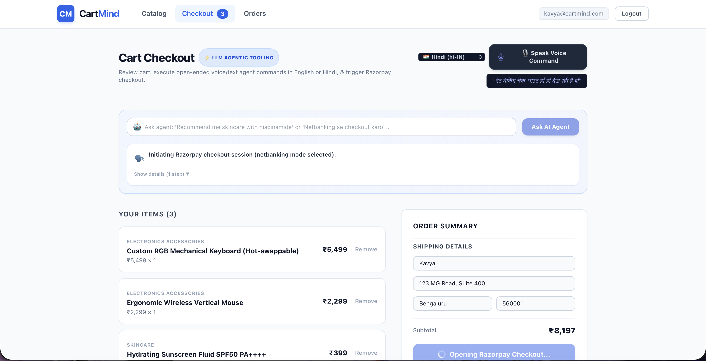
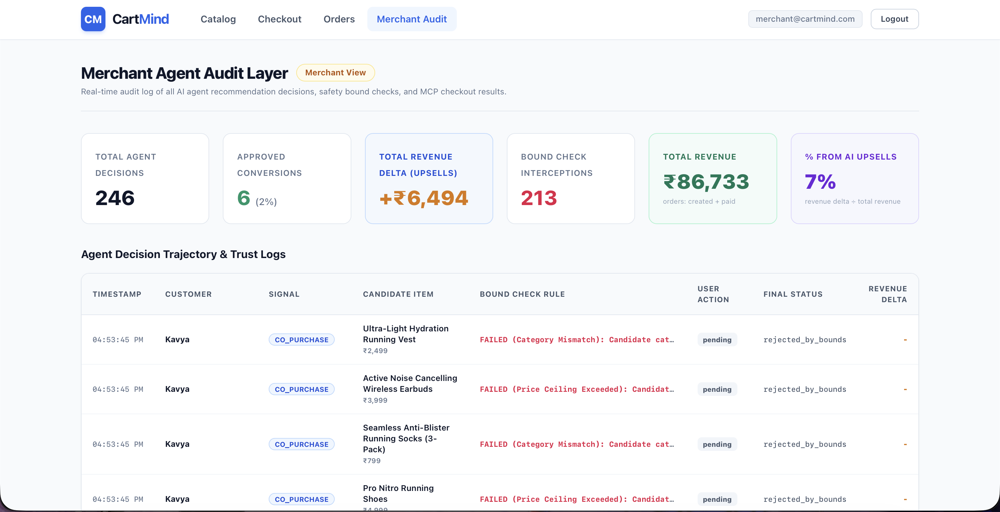
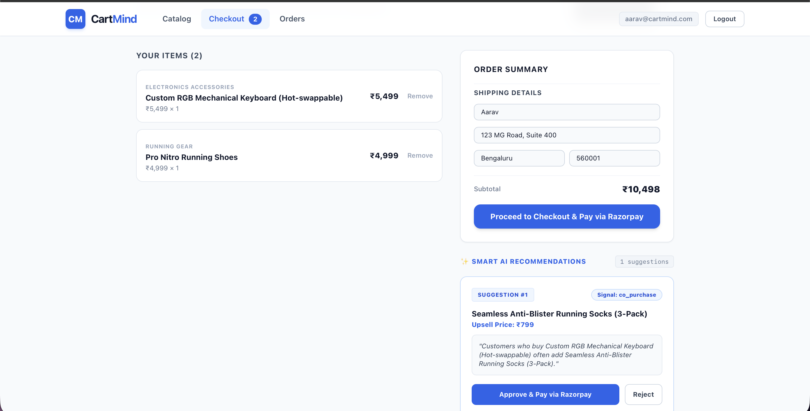
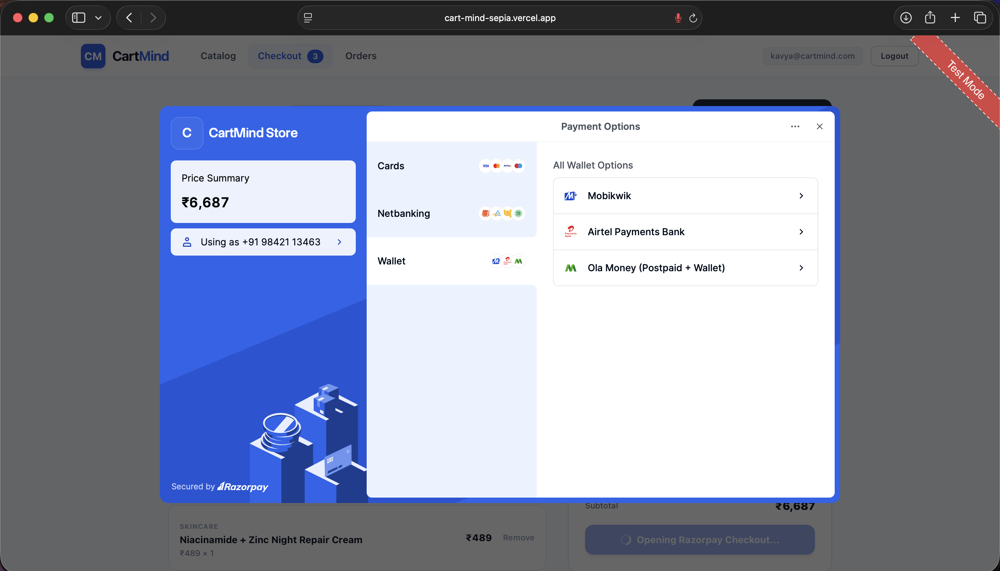

# CartMind

**AI-Powered Cart Optimization & Trust Infrastructure**
Track 01: AI Growth & Agentic Commerce


## Links
 
- **Live app**: https://cart-mind-sepia.vercel.app
- **GitHub repo**: [PASTE YOUR REPO URL]
- **Demo video**: [PASTE YOUR VIDEO LINK]
## What it solves

Merchants want AI agents to grow revenue, but "let an AI touch checkout" is scary without guardrails. CartMind is an AI shopping agent that looks at a customer's cart and purchase history, proposes a bounded, explainable upsell or replenishment reminder, gets explicit human approval, and only then executes a real payment through **Razorpay's own MCP server** — not a REST wrapper pretending to be agentic commerce.

The agent is conversational (English + Hindi, text or voice), can search the catalog and build a cart from open-ended requests ("recommend me skincare with niacinamide," "netbanking se checkout karo"), and every decision it makes — recommended, bounded, approved, rejected — is logged to an audit trail a merchant can inspect.

## Project structure

```
app/
├── api/
│   ├── catalog/route.ts               GET — public, agent-readable JSON-LD catalog
│   ├── recommend/route.ts             POST — runs both recommendation signals + bound check, logs to agent_decisions
│   ├── decisions/[id]/respond/route.ts POST — approval gate: independently re-validates bounds, fires MCP order on approve
│   ├── checkout/route.ts              POST — cart-only checkout, independent of any recommendation
│   ├── pay-status/route.ts            payment status check/callback for a given order
│   ├── voice-intent/route.ts          POST — Gemini tool-calling agent: parses open-ended text/voice into tool calls
│   └── audit/
│       ├── route.ts                   GET — merchant-only decision log + stats
│       └── orders-total/route.ts      GET — merchant-only total revenue figure (backs the "Total Revenue" stat card)
├── login/page.tsx, signup/page.tsx    Supabase Auth forms; signup includes Customer/Merchant role selector
├── catalog/page.tsx                   browse + add to cart
├── checkout/page.tsx                  cart, conversational agent box, recommendation cards, Razorpay Checkout.js handoff
├── orders/page.tsx                    logged-in customer's own order history (RLS-scoped, queried client-side)
├── audit/page.tsx                     Merchant Agent Audit Layer dashboard (merchant-only, server-verified)
├── layout.tsx                         root layout / nav
└── page.tsx                           root route ("/") — redirects by auth state and role

lib/
├── recommendation/engine.ts           the two signals + tiered bound check — deterministic, no LLM
├── mcp/razorpay.ts                    real MCP client (@modelcontextprotocol/sdk) → mcp.razorpay.com
└── supabase/
    ├── client.ts                      browser Supabase client
    ├── server.ts                      service-role client, server-only
    ├── middleware.ts                  session refresh / route protection
    ├── auth-helpers.ts                requireAuthenticatedCustomer(), rejectSpoofedCustomerId()
    └── types.ts                       generated/shared Supabase types

supabase/migrations/
├── 01_schema.sql                      products, customers, orders, order_items, agent_decisions
├── 02_schema_update.sql                replenishment_cycle_days, signal_type
├── 03_auth_rls.sql                     user_id link + Row-Level Security policies
└── 04_is_merchant.sql                  merchant role flag
```

## Data model

| Table | Purpose |
|---|---|
| `products` | catalog: name, category, price, `margin_flag` (merchant-only), `replenishment_cycle_days` (set only for consumables like skincare) |
| `customers` | linked to `auth.users` via `user_id`; `is_merchant` flag set at signup |
| `orders` / `order_items` | purchase history (both seed data and live Razorpay orders) |
| `agent_decisions` | the audit trail — one row per recommendation attempt: `signal_type`, `reasoning_text`, `bound_check_passed`, `bound_check_rule` (exact math shown), `user_response`, `mcp_call`/`mcp_result` (the literal MCP protocol payloads), `revenue_delta`, `final_status` |

RLS is enabled on `customers`, `orders`, `order_items`, `agent_decisions` — a customer can only read rows tied to their own `auth.uid()`. `/api/catalog` is the one deliberately public, unauthenticated route, since it's meant to be readable by outside agents/AI buyers too.

## How a recommendation decision actually gets made

1. **Signal A — co-purchase** (deterministic): query which products have historically appeared in the same order as items already in the cart, across customers. Not personalized to "you," which is honest — the reasoning text says "customers who buy X," not "you bought X."
2. **Signal B — replenishment** (deterministic): for this specific customer, check products with a `replenishment_cycle_days` value against days-since-last-purchase. If overdue, it wins priority over co-purchase (more personalized).
3. **Bound check** (hard-coded, not LLM-decided): cap = 10% of cart value if cart < ₹2,000, else 20%. Every result — pass or fail — is written to `agent_decisions` with the exact numbers ("PASSED: price ₹399 <= cap ₹1080 (20% tier, cart ₹5398)"), so a merchant can audit every rejection too, not just approvals.
4. **LLM reasoning**: Gemini is only used to phrase the chosen candidate into one readable sentence. It never sees the full candidate list and never picks the item — that decision is step 1/2/3 above, fully auditable without trusting a model's judgment.
5. **Approval gate**: `/api/decisions/[id]/respond` re-validates `bound_check_passed` server-side before allowing an approval — a decision that failed step 3 gets a hard 403 even if something tries to approve it directly. This is the actual "defense in depth": the gate doesn't just display what the recommend step already decided, it checks again independently.
6. **MCP checkout**: only on approval does a real MCP `tools/call` (`create_order`) go to `mcp.razorpay.com` — verified by inspecting the actual outbound domain and the literal MCP response shape (`{ content: [{ type: 'text', text: '...' }] }`), not just a plausible-looking JSON body.
7. **Real payment**: the customer completes payment through Razorpay's own Checkout.js UI (card/netbanking/UPI, test mode) — CartMind never sees or automates card details or OTP.

## Conversational agent

`/api/voice-intent` runs a genuine Gemini tool-calling loop (not a fixed phrase list) with five tools: `search_catalog`, `add_to_cart`, `remove_from_cart`, `get_recommendations`, `initiate_checkout`. It handles open-ended requests in English or Hindi — verified with phrases never used as examples anywhere in development (e.g. "I need something for oily skin, nothing too expensive" correctly triggered a catalog search, then independently filtered and reasoned about which results fit both the skin concern and the budget). Voice input uses the browser's native Web Speech API (`en-US` / `hi-IN`).

## Stack

- Next.js 14 (TypeScript, App Router) + Tailwind CSS
- Supabase (Postgres, Auth, Row-Level Security)
- Razorpay MCP server (`mcp.razorpay.com`), consumed via `@modelcontextprotocol/sdk` from inside the app itself
- Google Gemini (tool-calling agent for conversational checkout)
- Browser Web Speech API for voice input (English + Hindi)
- Deployed on Vercel

## What broke, and how I caught it

Being upfront about this because it's the most honest evidence of how the safety claims were actually verified, not just asserted:

**An AI-generated "MCP call" turned out to be a relabeled REST call.** Early in the build, an agent reported successfully calling Razorpay's MCP server, but the code was a plain `fetch()` to Razorpay's REST API with the request/response objects renamed to look like MCP fields. Caught by asking for the actual outbound request domain, not just the JSON response, since a correct-looking response doesn't prove the protocol used to get it. Fixed by requiring a real `@modelcontextprotocol/sdk` client and verifying the literal request hit `mcp.razorpay.com`, confirmed by the distinctive MCP content-block response shape.

**The merchant audit dashboard leaked every customer's data to every logged-in user.** `/audit` was using a service-role Supabase key to bypass RLS with no separate authorization check, meaning any customer account could see every other customer's recommendation history. Fixed with a server-verified `is_merchant` flag gating the route, tested by confirming a non-merchant account gets a real 403.

**Checkout could not complete at all if no recommendation passed its bounds.** A cart with no eligible upsell threw "Failed to initialize checkout session decision" and blocked the entire purchase, the most basic path (buy only what's in your cart) was broken. Fixed by decoupling checkout from recommendation approval entirely; a cart-only checkout path now works independently of whether any recommendation exists.

**The conversational agent's proactive recommendation panel is unreliable.** The panel that's meant to surface AI Smart Recommendations automatically as the cart changes intermittently returns zero suggestions or hangs on "Fetching..." even when the underlying recommendation engine (verified separately, directly against `/api/recommend`) is working correctly against real purchase history. Root cause not fully isolated before the deadline — most likely a client-side state/race issue introduced while wiring the conversational agent on top of the existing auto-trigger. Workaround used for the demo: the manual "Ask AI Agent" text/voice box, which is independently confirmed working (English and Hindi, add-to-cart, checkout-with-payment-preference, and graceful "no match found" responses all verified live). Documented here rather than hidden, since a judge asking "did you test this" deserves an honest answer.


## Running locally

```
npm install
# populate .env.local with Supabase, Razorpay, and Gemini credentials
npm run dev
```

Required environment variables: `NEXT_PUBLIC_SUPABASE_URL`, `NEXT_PUBLIC_SUPABASE_ANON_KEY`, `SUPABASE_SERVICE_ROLE_KEY`, `RAZORPAY_KEY_ID`, `RAZORPAY_KEY_SECRET`, `GEMINI_API_KEY`.


## Screenshots
 
| Conversational checkout (Hindi) | Merchant Audit dashboard |
|---|---|
|  |  |
 
| Recommendation card with bound check | Real Razorpay payment |
|---|---|
|  |  |
 